<!-- PROJECT TITLE -->
<h1 align="center">🔥 AI-Driven Threat Detection & Prioritization</h1>

  
  
  
  

🚨 <b>Alert Fatigue is Real</b> – SOC teams face thousands of alerts every day, and missing one critical threat can cost millions. 
This project solves that by using <b>AI-driven threat detection, prioritization, and visualization in real-time.</b>

---

## 📖 Table of Contents

- 🚩 [Problem Statement](#-problem-statement)
- ✨ [Features](#-features)
- 🧠 [System Architecture](#-system-architecture)
- 📊 [Screenshots & Visualizations](#-screenshots--visualizations)
- 🛠 [Tech Stack](#-tech-stack)
- ⚡ [Installation & Setup](#-installation--setup)
- 🖥 [Usage](#-usage)
- 📈 [Example Output](#-example-output)
- 🚀 [Future Enhancements](#-future-enhancements)
- 🤝 [Contributing](#-contributing)
- 📚 [References](#-references)

---

<h1 align="center">🚩 Problem Statement</h1>

Security teams face alert fatigue due to thousands of daily alerts.  
This leads to missed critical threats and delayed incident response.

Our project aims to:  
✅ _Detect_ threats in real-time using AI/ML  
✅ _Prioritize_ threats with risk scoring  
✅ _Visualize_ attacks on a global map  
✅ _Explain_ why each alert was classified as a threat

---

## ✨ Features

- 🔍 _AI-Driven Anomaly Detection_ – Trained on CICIDS 2017 dataset
- 📊 _Statistical IP Analysis_ – Track frequency of malicious IPs, destination ports, etc.
- 🌍 _Global Attack Visualization_ – Map attacker IPs on a world map with red markers
- 🏷 _Threat Prioritization & Explanation_ – Risk score, type and reason
- 🛢 _MongoDB Backend_ – Stores predictions in structured JSON format
- 🖥 _Interactive Dashboard_ – Clean UI to view, filter, and analyze threats

---

## 🧠 System Architecture

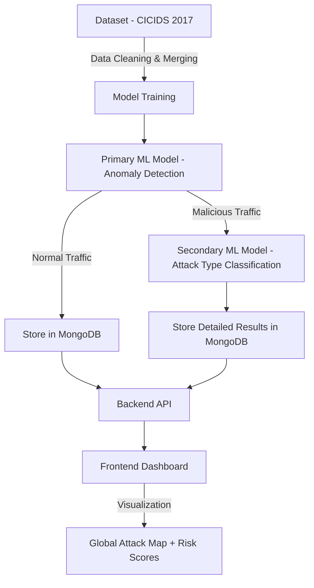

<h2>📊 Screenshots & Visualizations</h2>
Below are some key screenshots of our ML model training and prediction workflow:  

🧠 Model Training – Trained on the CICIDS 2017 dataset to classify network traffic as Normal or Malicious. 

🔎 Primary Prediction – First model classifies incoming logs in real time. 

🤖 Secondary Analysis (Gemini Model) – If malicious, a secondary ML model classifies the exact attack type (e.g., DDoS, PortScan). 

🛢 Data Storage – Predictions (both normal & malicious) are pushed into MongoDB for dashboard visualization. 

🌍 Visualization – Dashboard maps attackers, shows risk scores, and allows filtering for SOC analysis.  

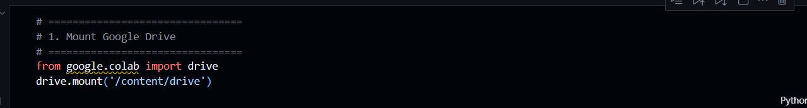
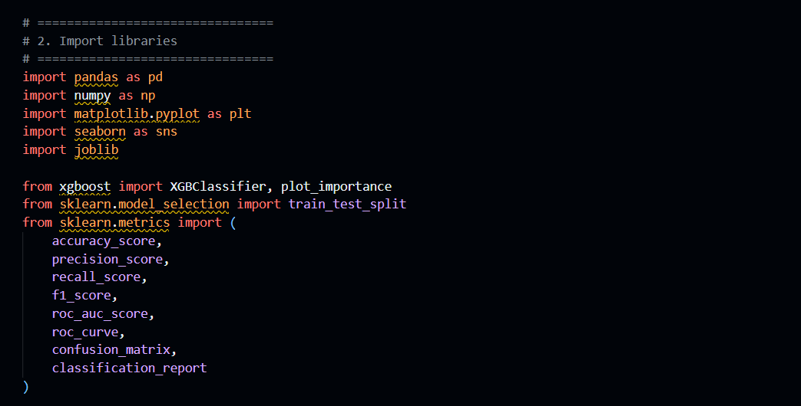
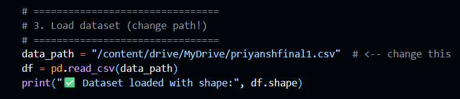

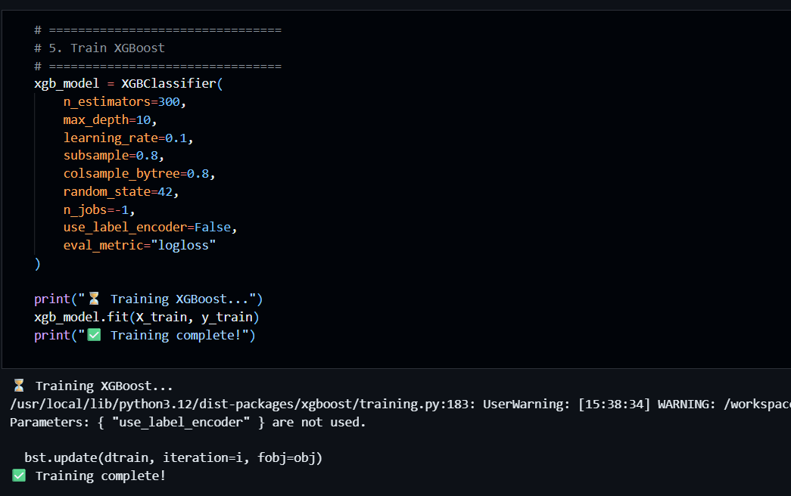
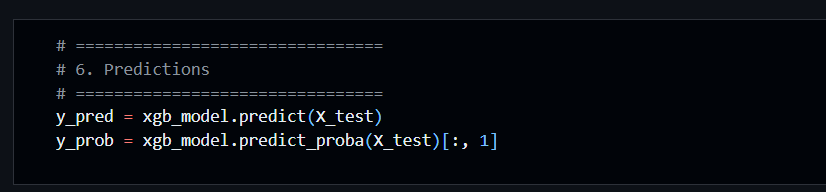
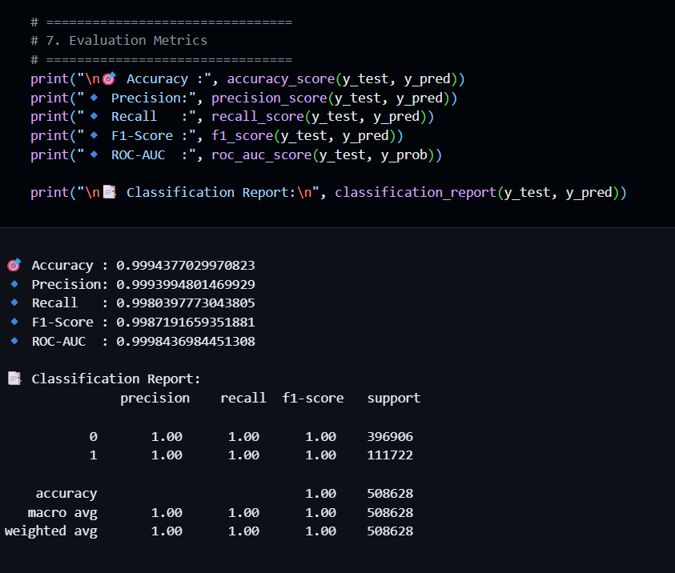
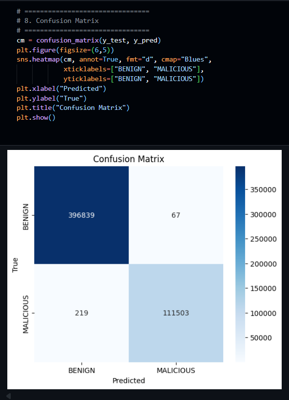
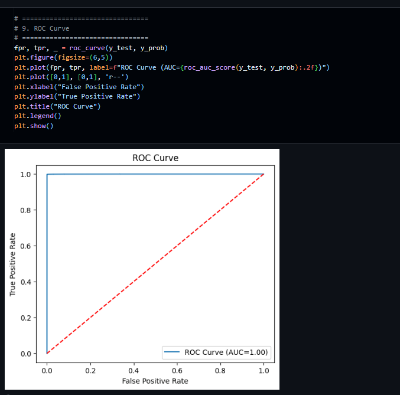
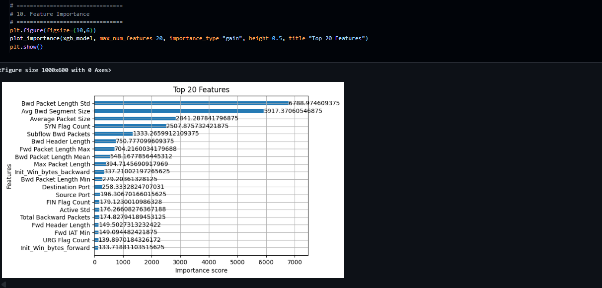

<!-- PoC Dashboard Screenshots -->
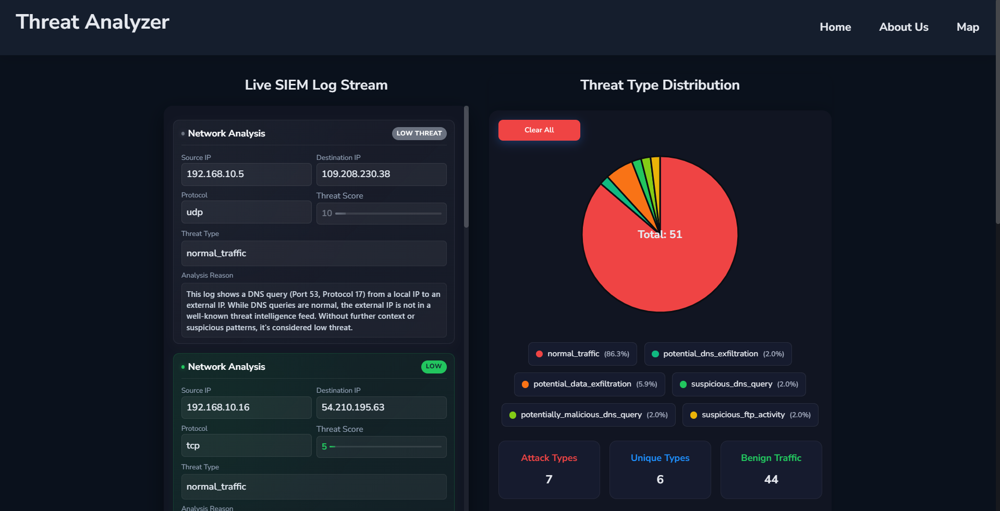

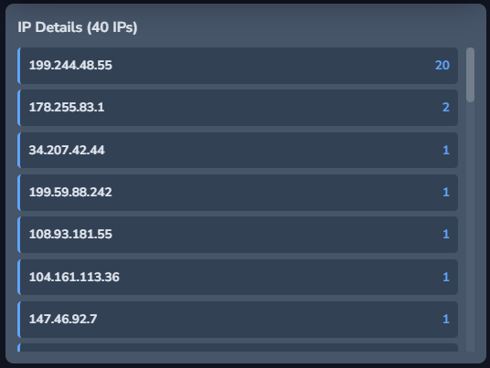
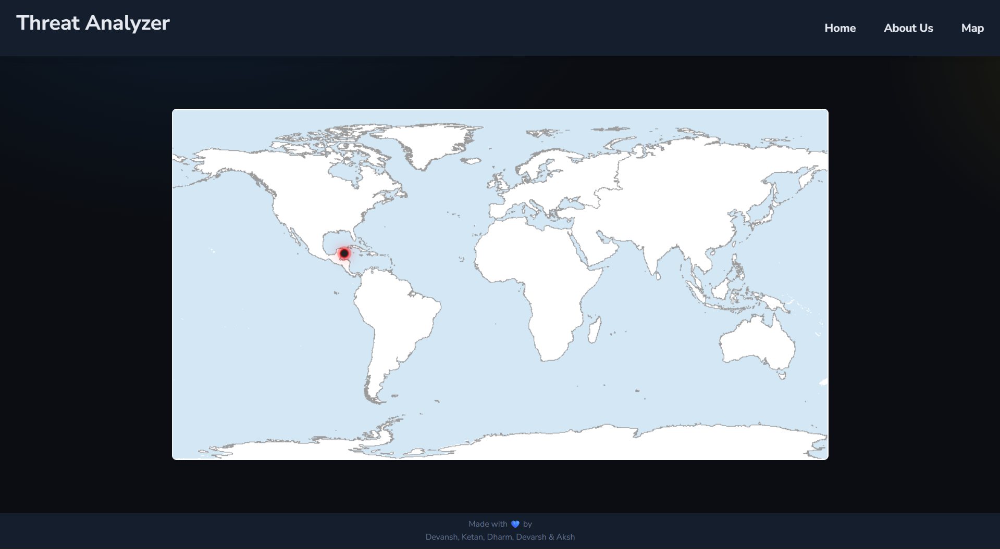
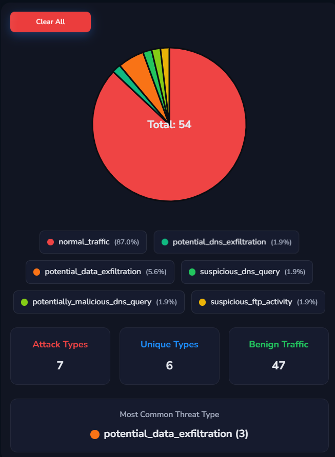
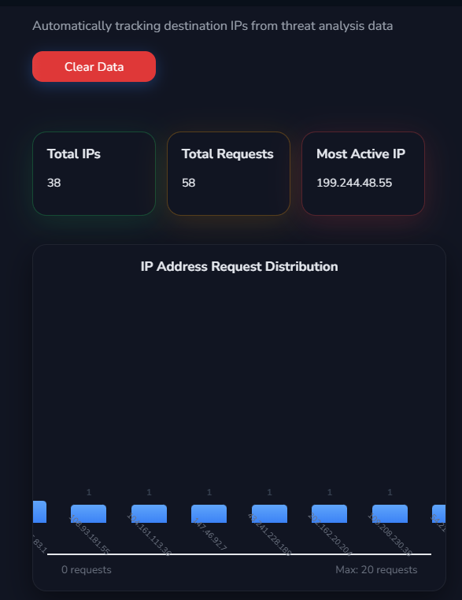

<!-- MongoDB Dashboard Screenshot -->
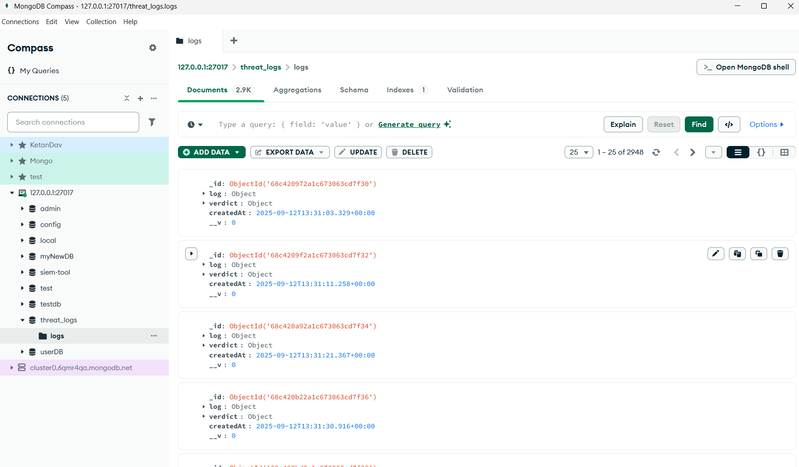

<h2>🛠 Tech Stack</h2>

Frontend: React.js, Chart.js

Backend: Node.js (Express)

Database: MongoDB

Machine Learning: Scikit-learn, Pandas, NumPy,

Dataset: CICIDS 2017 (Combined & Preprocessed)

<h2>⚡ Installation & Setup</h2>

# 1️⃣ Clone the repo

git clone https://github.com/devansh436/threat-detection.git 
cd threat-detection

# 2️⃣ Install backend dependencies

cd server 
npm install

# 3️⃣ Start the backend server

npm run dev

# 4️⃣ Start the frontend (if React)

cd client 
npm install 
npm run dev

# 5️⃣ Start the python microservice

pip install -r requirements.txt 
python3 ml-service.py

<h2>🖥 Usage</h2>
Upload network logs or use sample data 
Model will process logs & generate predictions 
Visit dashboard → See threats, risk scores & map visualization 
Filter results by threat type or risk level

<h2>📈 Example Output</h2>

{ 
"source_ip": "192.168.15.22", 
"dest_ip": "192.168.10.1", 
"protocol": "udp", 
"threat_score": 15, 
"threat_level": "Low", 
"reason": "The log shows a single DNS query (UDP port 53) from a local IP to another local IP. This is generally normal network activity.", 
"threat_type": "normal_traffic" 
}

<h2>🚀 Future Enhancements</h2>

📈 More explainable AI with SHAP/LIME 
🧠 Deep Learning models for advanced detection

<h2>🤝 Contributing</h2>

We welcome contributions!
Feel free to fork this repo, make changes, and submit a pull request.
For major changes, open an issue first to discuss what you would like to change.

<h2>👨‍💻 Team Members</h2>

Ketan Dav (Team Lead) 
Devansh Deshpande 
Dharm Patel 
Aksh Patel 
Devarsh Dalwadi

<h2>📚 References</h2>

- [CICIDS 2017 Dataset](https://www.unb.ca/cic/datasets/ids-2017.html)
- [Scikit-learn Documentation](https://scikit-learn.org/stable)
- [MongoDB Docs](https://www.mongodb.com/docs/)
